# InsureEdge Architecture Diagrams

**Visual representations of the solution architecture using Mermaid**

---

## 1. High-Level System Architecture

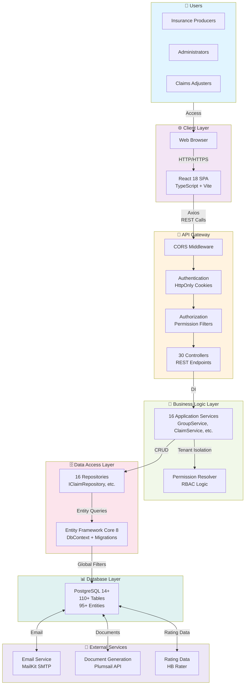

---

## 2. Frontend Architecture

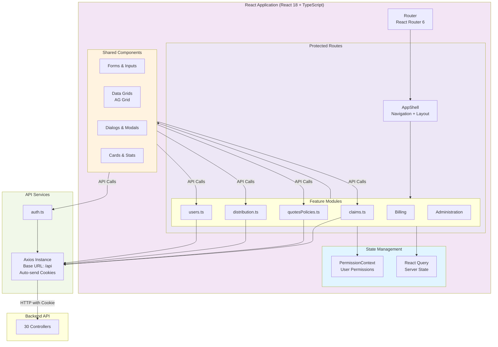

---

## 3. Backend Layered Architecture

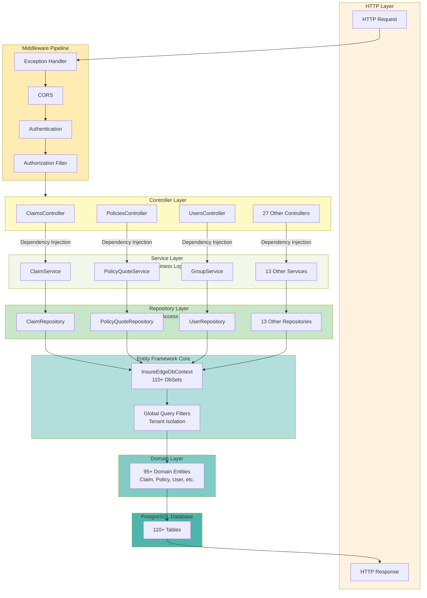

---

## 4. Request Processing Pipeline

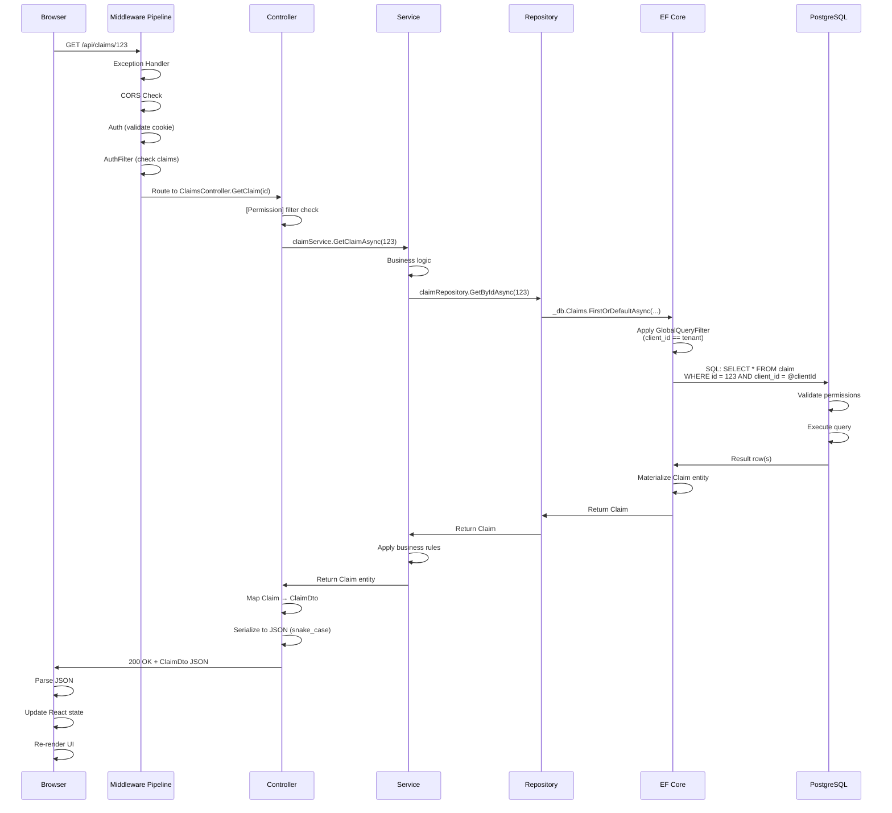

---

## 5. Authentication & Authorization Flow

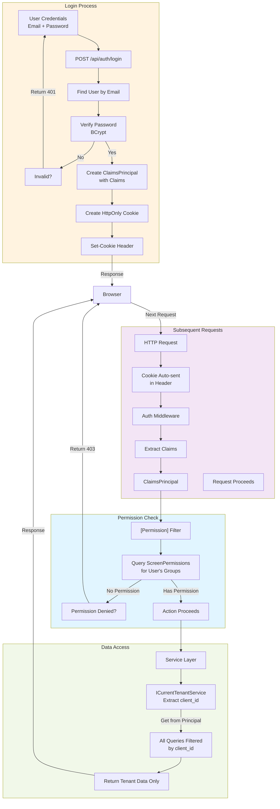

---

## 6. Data Access & Multi-Tenancy

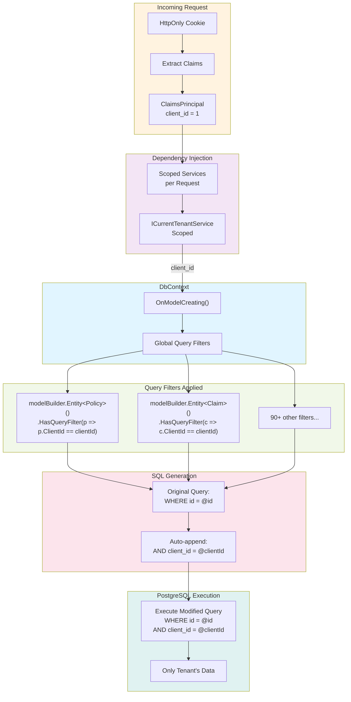

---

## 7. Module Communication

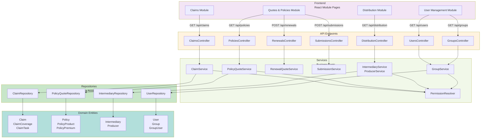

---

## 8. Claims Workflow

```mermaid
stateDiagram-v2
    [*] --> FNOL
    
    FNOL: FNOL Reported
    FNOL: (claim created)
    
    INVEST: Investigation
    INVEST: (adjuster assigned)
    
    RESERVE: Reserve Setup
    RESERVE: (reserve calculated)
    
    APPROVED: Reserve Approved
    APPROVED: (manager approved)
    
    SETTLEMENT: Settlement
    SETTLEMENT: (payment processed)
    
    CLOSED: Claim Closed
    CLOSED: (completed)
    
    FNOL -->|Verify Coverage| INVEST
    INVEST -->|Calculate Reserve| RESERVE
    RESERVE -->|Request Approval| APPROVED
    APPROVED -->|Approve Reserve| SETTLEMENT
    SETTLEMENT -->|Process Payment| CLOSED
    CLOSED --> [*]
    
    INVEST -.->|Deny Coverage| [*]
    RESERVE -.->|Insufficient Funds| INVEST
```

---

## 9. Quote to Policy Workflow

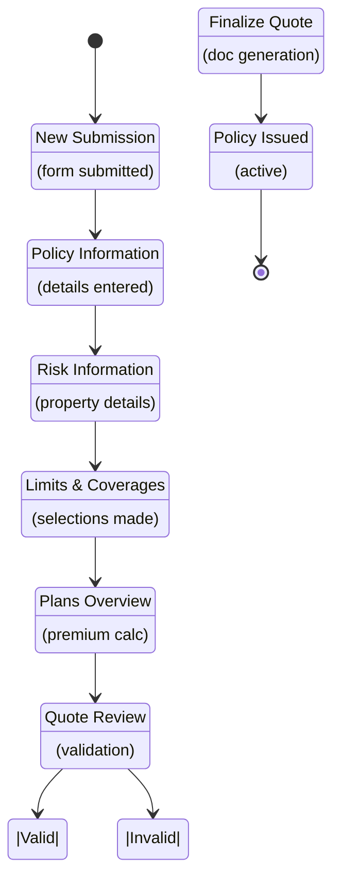

---

## 10. Database Entity Relationships

```mermaid
graph TB
    subgraph Access["Access Control"]
        User["User"]
        Group["Group"]
        GroupUser["GroupUser<br/>(join)"]
        Module["Module"]
        Screen["AppScreen"]
        Permission["ScreenPermissions"]
    end
    
    subgraph Distribution["Distribution & Intermediaries"]
        Intermediary["Intermediary"]
        Producer["Producer"]
        Account["Account"]
        ISP["IntermediaryScreenPermission"]
    end
    
    subgraph Client["Client Management"]
        Client["Client"]
        ClientAddr["ClientAddress"]
        ClientContact["ClientContact"]
        ClientOffice["ClientOffice"]
    end
    
    subgraph Underwriting["Quotes & Policies"]
        Policy["Policy"]
        PolicyExt["PolicyExtended"]
        PolicyAccount["PolicyAccount"]
        Insured["Insured"]
        AddInsured["AdditionalInsured"]
        RiskLoc["RiskLocation"]
        RiskAddr["RiskAddress"]
        PolicyProduct["PolicyProduct"]
        PolicyCoverage["PolicyLimitCoverage"]
        PolicyPremium["PolicyPremium"]
        Submission["Submission"]
        RenewalNotice["RenewalNotice"]
    end
    
    subgraph Claims["Claims Management"]
        Claim["Claim"]
        ClaimCov["ClaimCoverage"]
        ClaimCovLim["ClaimCoverageLimit"]
        Claimant["Claimant"]
        ClaimTask["ClaimTask"]
        ClaimWorksheet["ClaimWorksheet"]
        WorksheetRes["WorksheetReserve"]
        WorksheetPay["WorksheetPayment"]
        ClaimLetter["ClaimLetter"]
    end
    
    User -->|belongs to| GroupUser
    GroupUser -->|joins| Group
    Group -->|accesses| Permission
    Permission -->|for| Screen
    Screen -->|in| Module
    
    Intermediary -->|has many| Producer
    Producer -->|has| Account
    Intermediary -->|has| ISP
    ISP -->|grants| Screen
    
    Client -->|has many| ClientAddr
    Client -->|has many| ClientContact
    Client -->|has many| ClientOffice
    
    Policy -->|belongs to| Client
    Policy -->|extends| PolicyExt
    Policy -->|has| PolicyAccount
    Policy -->|relates to| Insured
    Policy -->|has| AddInsured
    Policy -->|has| RiskLoc
    RiskLoc -->|has| RiskAddr
    Policy -->|has| PolicyProduct
    Policy -->|has| PolicyCoverage
    Policy -->|has| PolicyPremium
    Policy -->|from| Submission
    Policy -->|has| RenewalNotice
    
    Claim -->|references| Policy
    Claim -->|has| ClaimCov
    ClaimCov -->|has| ClaimCovLim
    Claim -->|has| Claimant
    Claim -->|has| ClaimTask
    Claim -->|has| ClaimWorksheet
    ClaimWorksheet -->|has| WorksheetRes
    ClaimWorksheet -->|has| WorksheetPay
    Claim -->|has| ClaimLetter
    
    style Access fill:#fff3e0
    style Distribution fill:#f3e5f5
    style Client fill:#e1f5ff
    style Underwriting fill:#f1f8e9
    style Claims fill:#fce4ec
```

---

## 11. Service Dependencies

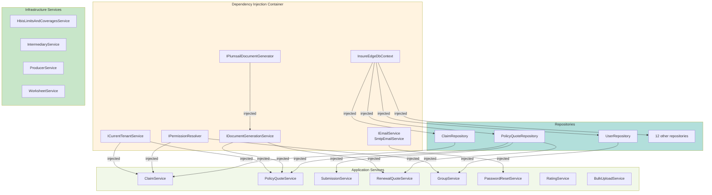

---

## 12. Frontend Permission Flow

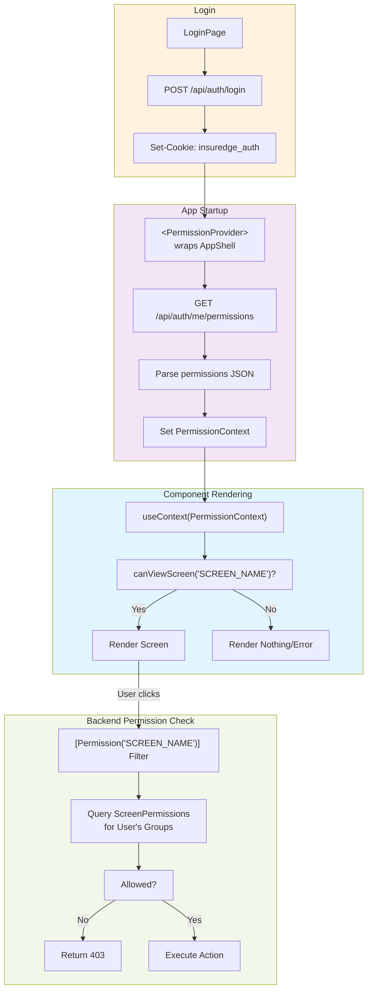

---

## 13. External Service Integration

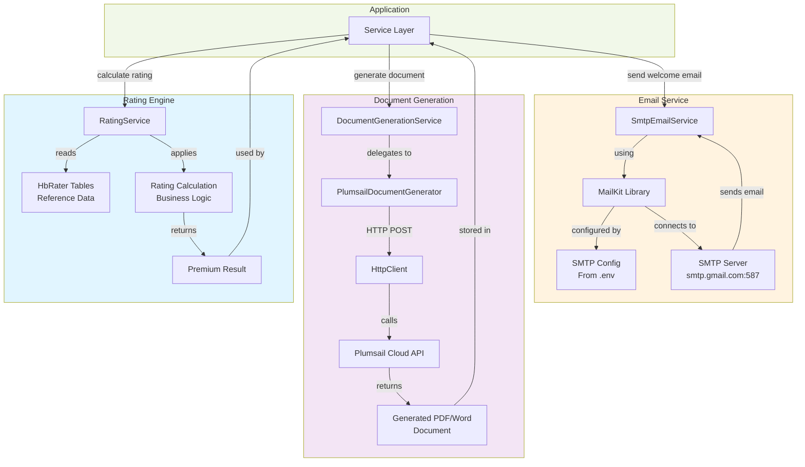

---

## 14. Infrastructure Components

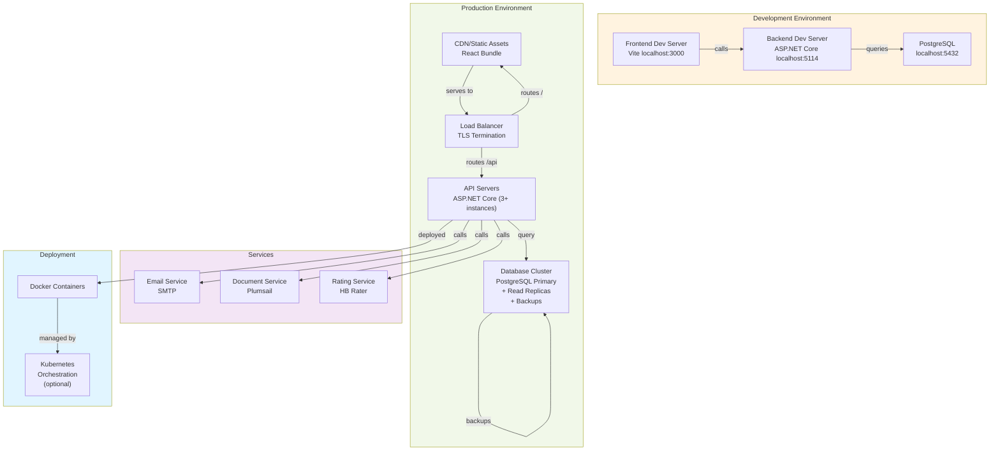

---

## 15. Error Handling Flow

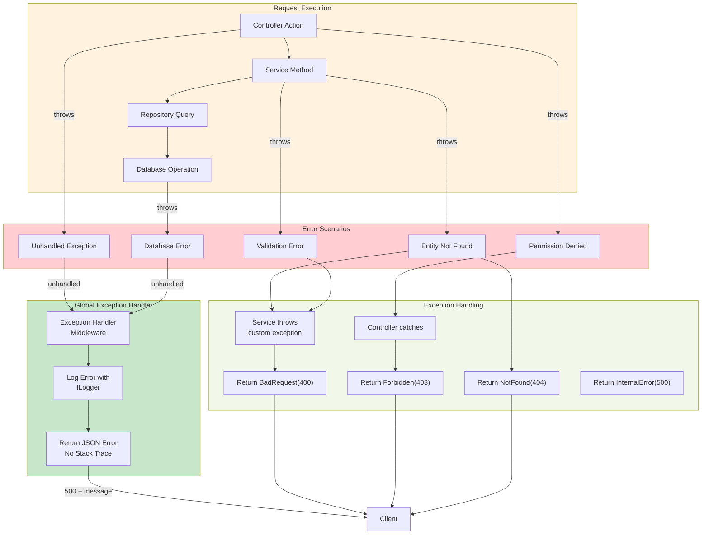

