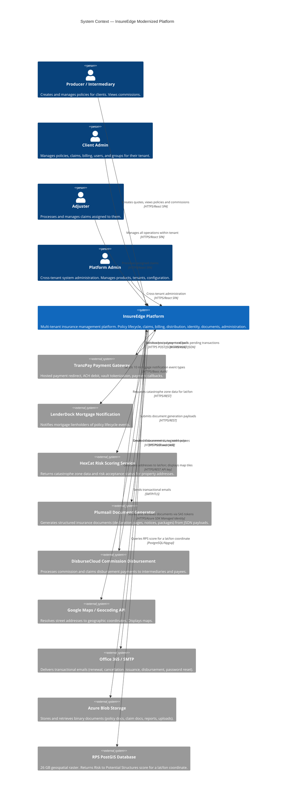

# ART-3-003 — C4 Architecture Diagrams
## InsureEdge Application Modernization (INSUREEDGE-2026)
**Produced by:** Architecture Agent
**Phase:** IDEATE
**Date:** 2026-06-17
**Version:** 1.0 — GATE CANDIDATE
**Format:** Mermaid text diagrams (no image tools required)

---

## Level 1 — System Context Diagram

**Purpose:** Shows InsureEdge as a system and its relationships to users and external systems.



---

## Level 2 — Container Diagram

**Purpose:** Shows the deployable units that make up the InsureEdge system, and their interactions.

```mermaid
C4Container
    title Container Diagram — InsureEdge Platform (Azure)

    Person(user, "User (all roles)", "Browser-based access")

    Boundary(azure, "Azure Subscription — InsureEdge") {
        Container(spa, "React SPA", "React 18 / TypeScript / Vite", "Single-page application. All 65 screens across 7 domains. Deployed to Azure Static Web Apps.")
        Container(api, "ASP.NET Core Web API", ".NET 8 / C# — Modular Monolith", "All business logic, domain services, repositories. 7 domain modules + shared infrastructure. Deployed to Azure App Service (Linux).")
        Container(db, "PostgreSQL Database", "Azure Database for PostgreSQL Flexible Server", "Operational data: policies, claims, billing, users. Schema: public (operational), system (tenant/config). PostGIS extension enabled.")
        Container(gisDb, "RPS GIS Database", "PostgreSQL + PostGIS (same Flexible Server)", "26 GB RPS raster dataset. Separate 'gis' database on same Flexible Server instance. Queried by API via Npgsql.")
        Container(redis, "Redis Cache", "Azure Cache for Redis (Basic C1)", "Caches: permission maps per user, rate table lookups (HBRater), geocoding results, session-adjacent data. TTL-based invalidation.")
        Container(blob, "Azure Blob Storage", "Existing account — insureedgeapplication container", "Binary document storage. Path convention: ClientCode/ModuleName/RecordId/Filename. SAS tokens for time-limited download access.")
        Container(keyVault, "Azure Key Vault", "Per-environment Key Vault", "All integration credentials, encryption key, JWT signing key, connection strings. Accessed by App Service via Managed Identity.")
        Container(appInsights, "Azure Application Insights", "Application Insights Workspace", "Structured logs, request telemetry, dependency tracking, custom metrics, alerts.")
        Container(appConfig, "Azure App Configuration", "Feature flags and thresholds", "Non-secret runtime configuration: timer enable/disable flags, threshold values (renewal days, cancellation days), bypass flags.")
        Container(appGateway, "Azure Application Gateway + WAF", "OWASP 3.2 WAF rules", "L7 load balancing, WAF, SSL termination. Routes traffic to App Service.")
    }

    Rel(user, appGateway, "HTTPS requests", "Port 443")
    Rel(appGateway, spa, "Static asset delivery", "HTTPS")
    Rel(appGateway, api, "API requests proxied", "HTTPS /api/v1/")
    Rel(spa, api, "API calls", "HTTPS REST/JSON")
    Rel(api, db, "Read/write operational data", "PostgreSQL/Npgsql + EF Core 8")
    Rel(api, gisDb, "RPS spatial queries", "PostgreSQL/Npgsql raw SQL")
    Rel(api, redis, "Cache reads/writes", "StackExchange.Redis")
    Rel(api, blob, "Document store/retrieve", "Azure.Storage.Blobs SDK + Managed Identity")
    Rel(api, keyVault, "Secret loading at startup", "Azure.Security.KeyVault.Secrets + Managed Identity")
    Rel(api, appConfig, "Runtime config read", "Azure.Data.AppConfiguration SDK")
    Rel(api, appInsights, "Telemetry, logs, metrics", "ApplicationInsights SDK")

    Rel_Ext(api, tranzPay, "Payment initiation and polling", "HTTPS POST")
    Rel_Ext(tranzPay, api, "Payment callback webhook", "HTTPS POST /api/webhooks/tranzpay/callback")
    Rel_Ext(api, lenderDock, "Mortgage notifications", "HTTPS/Basic Auth")
    Rel_Ext(api, hexCat, "Risk scoring", "HTTPS/REST")
    Rel_Ext(api, plumsail, "Document generation", "HTTPS/REST")
    Rel_Ext(api, disburseCloud, "Commission disbursement", "HTTPS/Bearer JWT")
    Rel_Ext(disburseCloud, api, "Disbursement webhooks", "HTTPS POST /api/webhooks/disburse/callback")
    Rel_Ext(api, smtp, "Transactional email", "SMTP/TLS")
    Rel_Ext(api, googleMaps, "Geocoding and map tiles", "HTTPS/REST")
```

---

## Level 3 — Component Diagram: Policy Lifecycle Domain

**Purpose:** Shows the internal components of the Policy domain module within the ASP.NET Core API (most complex domain — 6 capability clusters, integrates with all major external systems).

```mermaid
C4Component
    title Component Diagram — Policy Domain Module (ASP.NET Core API)

    Boundary(policyModule, "Policy Domain Module") {
        Component(quoteCtrl, "QuoteController", "ASP.NET Core Controller", "Handles quote creation, submission, step progression, coverage selection. Routes: /api/v1/quotes/")
        Component(policyCtrl, "PolicyController", "ASP.NET Core Controller", "Handles policy binding, endorsement, renewal, cancellation, policy retrieval. Routes: /api/v1/policies/")
        Component(bulkCtrl, "BulkUploadController", "ASP.NET Core Controller", "Handles bulk policy file upload. Routes: /api/v1/policies/bulk-upload")

        Component(quoteSvc, "QuoteService", "Domain Service", "Orchestrates quote creation workflow. Validates insured, geocodes address, calls HexCat, computes premium via RatingEngine, enforces expiry rules.")
        Component(bindingSvc, "PolicyBindingService", "Domain Service", "Orchestrates policy binding: duplicate check, payment initiation, policy number generation, document generation trigger, LenderDock notification.")
        Component(endorseSvc, "EndorsementService", "Domain Service", "Mid-term endorsement: premium differential, refund/collect, commission recalc, document generation.")
        Component(renewalSvc, "RenewalService", "Domain Service", "Renewal quote generation (90-day), auto-renewal binding, non-renewal notices.")
        Component(cancellationSvc, "CancellationService", "Domain Service", "Voluntary cancellation, auto-cancellation (30-day missed payment), cancel/rewrite, refund calculation.")
        Component(ratingEngine, "RatingEngineService", "Internal Service", "Reads HBRater rate tables (LRHexzones, HRHexzone, StateTaxSheet, ExcessFloodCoverage, Wildfire). Computes coverage premium, taxes, fees, total premium.")
        Component(policyRepo, "PolicyRepository", "EF Core Repository", "CRUD for Policy, PolicyPremium, PolicyLimitCoverage, PolicyProduct, PolicyRiskInformation, PolicyMortgage, PolicyDocument entities. All queries include ClientId filter via EF global filter.")
        Component(commissionSvc, "CommissionService", "Domain Service", "Calculates commission (premium × rate) for new business, endorsement, renewal. Creates PolicyCommission and CommissionPaymentTransaction records.")
    }

    Boundary(sharedInfra, "Shared Infrastructure (cross-module)") {
        Component(geocodingSvc, "GeocodingService", "Infrastructure Service", "Calls Google Geocoding API. Returns lat/lon. Caches results in Redis by address hash.")
        Component(rpsSvc, "RpsService", "Infrastructure Service", "Executes PostGIS ST_Value query against gis.rps_raster_5070. Returns RPS score or OutOfCoverage sentinel.")
        Component(paymentSvc, "TranzPayService", "Infrastructure Service", "Initiates ThirdParty hosted redirect. Polls pending transactions. Processes refunds. Reads credentials from Key Vault.")
        Component(documentSvc, "PlumsailDocumentService", "Infrastructure Service", "Submits JSON payload to Plumsail. Receives document blob. Stores to Azure Blob. Saves path in PolicyDocument.")
        Component(lenderDockSvc, "LenderDockService", "Infrastructure Service", "Sends 10 LenderDock notification event types with Basic Auth. Retry tracked in NotifyLenderdock table.")
        Component(emailSvc, "EmailService", "Infrastructure Service", "Sends transactional emails via SMTP/Office365. 17+ trigger points across all domains.")
        Component(auditSvc, "AuditService", "Infrastructure Service", "Writes to AuditLog table. Captures UserId, action, entity, record, session, timestamp. PlatformAdmin cross-tenant actions tagged with TargetClientId.")
        Component(tenantCtx, "ITenantContext", "Middleware-injected", "Provides ClientId, UserId, Role, IntermediaryId, AdjusterId. Resolved from JWT claims. Never returns ClientId=0.")
        Component(permSvc, "PermissionEvaluationService", "Infrastructure Service", "Evaluates effective permission flags for a user+screen combination. Redis-cached. Falls back to DB on cache miss.")
    }

    Rel(quoteCtrl, quoteSvc, "Delegates quote workflow")
    Rel(policyCtrl, bindingSvc, "Delegates binding workflow")
    Rel(policyCtrl, endorseSvc, "Delegates endorsement workflow")
    Rel(policyCtrl, renewalSvc, "Delegates renewal workflow")
    Rel(policyCtrl, cancellationSvc, "Delegates cancellation workflow")

    Rel(quoteSvc, policyRepo, "Reads/writes draft quote data")
    Rel(quoteSvc, geocodingSvc, "Geocodes risk location address")
    Rel(quoteSvc, rpsSvc, "Gets RPS score for risk location")
    Rel(quoteSvc, ratingEngine, "Computes premium")
    Rel(quoteSvc, tenantCtx, "Gets ClientId for scoping")

    Rel(bindingSvc, policyRepo, "Reads quote, writes policy, writes PolicyDocument path")
    Rel(bindingSvc, paymentSvc, "Initiates hosted payment redirect")
    Rel(bindingSvc, documentSvc, "Triggers declaration page generation")
    Rel(bindingSvc, lenderDockSvc, "Sends binding notification if mortgagee present")
    Rel(bindingSvc, commissionSvc, "Calculates and records commission")

    Rel(endorseSvc, policyRepo, "Reads active policy, writes endorsement record")
    Rel(endorseSvc, paymentSvc, "Collects additional premium or processes refund")
    Rel(endorseSvc, documentSvc, "Generates endorsement documents")
    Rel(endorseSvc, lenderDockSvc, "Notifies lienholder of coverage change")
    Rel(endorseSvc, commissionSvc, "Recalculates commission")

    Rel(renewalSvc, policyRepo, "Reads expiring policies, writes renewal quotes")
    Rel(renewalSvc, emailSvc, "Sends renewal notification emails")
    Rel(renewalSvc, lenderDockSvc, "Notifies lienholder of renewal")

    Rel(cancellationSvc, policyRepo, "Updates policy status, writes cancellation record")
    Rel(cancellationSvc, paymentSvc, "Processes refund")
    Rel(cancellationSvc, documentSvc, "Generates cancellation notice")
    Rel(cancellationSvc, lenderDockSvc, "Sends cancellation notification")

    Rel(ratingEngine, db, "Reads HBRater_* rate tables directly via DbContext", "EF Core / raw SQL")

    Rel(bindingSvc, auditSvc, "Logs binding action")
    Rel(endorseSvc, auditSvc, "Logs endorsement action")
    Rel(cancellationSvc, auditSvc, "Logs cancellation action")

    Rel(quoteCtrl, permSvc, "Checks Create/Edit permission before route handler executes")
    Rel(policyCtrl, permSvc, "Checks required permission flags")
```

---

## Architecture Notes on Diagram Conventions

1. **All C3 components reside in the single ASP.NET Core process** — these are logical components, not separate deployments.
2. **`ITenantContext`** is injected into every domain service and repository. The diagram shows it connected only to `quoteCtrl`→`quoteSvc` for clarity — it applies to all domain services.
3. **EF Core Global Query Filters** on `PolicyRepository` and all other repositories apply `ClientId` scoping automatically — callers do not add `WHERE ClientId = X` manually.
4. **Hangfire background jobs** (11 timers) call the same domain services shown above (e.g., `RenewalService.GenerateRenewalQuotesAsync()`) — they are callers of the service layer, not separate components.
5. **Webhook controllers** (TranzPay callback, DisburseCloud callback) are in their respective domain modules (Billing, Distribution) — not shown in the Policy C4 for scope reasons.

---

*End of ART-3-003 — C4 Architecture Diagrams | INSUREEDGE-2026 | IDEATE Phase | 2026-06-17*
